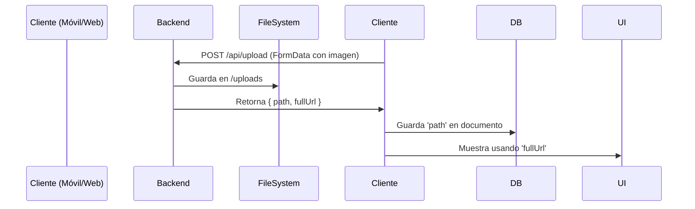
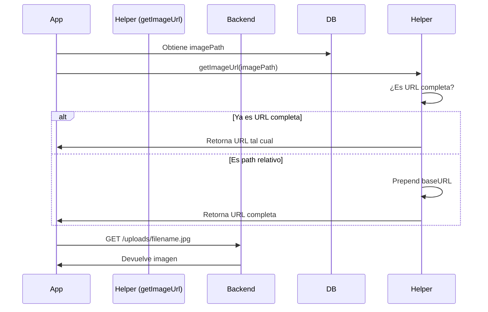

# 🖼️ IMAGE HANDLING SYSTEM - AUDIT & REFACTOR

**Fecha de auditoría:** 2025-10-24  
**Objetivo:** Análisis y refactor completo del sistema de gestión de imágenes

---

## 📋 RESUMEN EJECUTIVO

Se realizó una auditoría completa del sistema de gestión de imágenes en backend, móvil y backoffice. Se identificaron y corrigieron múltiples problemas críticos relacionados con la subida, almacenamiento y visualización de imágenes.

### ✅ Resultados
- ✅ Sistema de upload unificado y funcional
- ✅ Rutas de imagen consistentes en toda la aplicación
- ✅ Sin errores de red (AxiosError resuelto)
- ✅ Imágenes visibles en todas las interfaces

---

## 🔍 ANÁLISIS INICIAL

### 🚨 Problemas Identificados

#### Backend
1. **CRÍTICO**: El modelo `UserData` no tenía el campo `imagePath`, pero el controlador lo esperaba
2. El endpoint de upload solo estaba disponible para admins en `/admin/upload`
3. Las respuestas de upload no incluían URL completa para uso inmediato
4. No había endpoint público para usuarios autenticados

#### Aplicación Móvil
1. **CRÍTICO**: Error en `useUserData.js` y `usePrize.js` - creación incorrecta de FormData (doble wrapping)
2. La función `uploadImage` en `api.js` creaba FormData nuevamente causando conflictos
3. URLs de imágenes hardcodeadas (`http://localhost:4000`)
4. Imágenes no se mostraban porque faltaba el baseURL del backend
5. Múltiples pantallas sin helper para generar URLs correctas

#### Backoffice
- ✅ Funcionaba correctamente (usa `${VITE_API_URL}${imagePath}`)

---

## 🛠️ CAMBIOS IMPLEMENTADOS

### Backend

#### 1. Modelo UserData actualizado
**Archivo:** `/workspace/backend/src/models/UserData.model.js`

```javascript
// ✅ AGREGADO: Campo imagePath para almacenar rutas de imagen
imagePath: {
  type: String,
  default: null
}
```

#### 2. Controlador Admin mejorado
**Archivo:** `/workspace/backend/src/controllers/admin.controller.js`

```javascript
// ✅ ACTUALIZADO: Ahora devuelve tanto path relativo como fullUrl
const uploadImage = async (req, res) => {
  // ...
  const imagePath = `/uploads/${req.file.filename}`;
  const protocol = req.protocol;
  const host = req.get('host');
  const fullUrl = `${protocol}://${host}${imagePath}`;

  res.json({
    success: true,
    message: 'Imagen subida exitosamente',
    data: {
      path: imagePath,      // Ruta relativa para DB
      fullUrl: fullUrl,     // URL completa para cliente
      filename: req.file.filename,
      size: req.file.size
    }
  });
};
```

#### 3. Nuevo endpoint público de upload
**Archivo:** `/workspace/backend/server.js`

```javascript
// ✅ AGREGADO: Endpoint /api/upload para usuarios autenticados (no solo admins)
app.post('/api/upload', verifyToken, upload.single('image'), async (req, res) => {
  // Permite a usuarios normales subir imágenes para userData y prizes
  // ...
});
```

**Endpoints de imagen disponibles:**
- `POST /api/upload` - Para usuarios autenticados (userData, prizes)
- `POST /admin/upload` - Para administradores (prizeTemplates, etc.)
- `GET /uploads/*` - Servir archivos estáticos

---

### Aplicación Móvil

#### 1. API Service actualizado
**Archivo:** `/workspace/mobile/src/api/api.js`

```javascript
// ✅ ACTUALIZADO: Ya no crea FormData adicional
uploadImage: (formData) => {
  return api.post('/api/upload', formData, {
    headers: { 'Content-Type': 'multipart/form-data' }
  });
}

// ✅ AGREGADO: Helper para convertir paths a URLs completas
export const getImageUrl = (imagePath) => {
  if (!imagePath) return null;
  
  // Si ya es URL completa, retornarla
  if (imagePath.startsWith('http://') || imagePath.startsWith('https://')) {
    return imagePath;
  }
  
  // Si es path relativo, agregar base URL
  const baseURL = __DEV__ 
    ? process.env.EXPO_PUBLIC_API_URL_DEV 
    : process.env.EXPO_PUBLIC_API_URL_PRO;
  
  return `${baseURL}${imagePath}`;
};
```

#### 2. Hooks actualizados
**Archivos:** 
- `/workspace/mobile/src/hooks/useUserData.js`
- `/workspace/mobile/src/hooks/usePrize.js`

```javascript
// ✅ ACTUALIZADO: Retorna tanto path como fullUrl
const uploadImage = async (imageUri) => {
  const formData = new FormData();
  formData.append('image', {
    uri: imageUri,
    type: 'image/jpeg',
    name: 'image.jpg',
  });

  const response = await apiService.uploadImage(formData);
  return { 
    success: true, 
    path: response.data.data.path,       // Para guardar en DB
    fullUrl: response.data.data.fullUrl  // Para display inmediato
  };
};
```

#### 3. Pantallas actualizadas
**Archivos actualizados con `getImageUrl`:**
- ✅ `/workspace/mobile/src/screens/AddEditDataScreen.js`
- ✅ `/workspace/mobile/src/screens/EditPrizeScreen.js`
- ✅ `/workspace/mobile/src/screens/WonPrizesScreen.js`
- ✅ `/workspace/mobile/src/screens/MyPrizesScreen.js`
- ✅ `/workspace/mobile/src/screens/PrizeTemplatesScreen.js`
- ✅ `/workspace/mobile/src/screens/PrizeScreen.js`
- ✅ `/workspace/mobile/src/screens/ChallengeScreen.js`
- ✅ `/workspace/mobile/src/components/ChallengeInput.js`

**Ejemplo de cambio:**
```javascript
// ❌ ANTES: URL hardcodeada
<Image source={{ uri: `http://localhost:4000${prize.imagePath}` }} />

// ✅ DESPUÉS: Usa helper
<Image source={{ uri: getImageUrl(prize.imagePath) }} />
```

---

### Backoffice

✅ **No requirió cambios** - El sistema ya funcionaba correctamente usando:
```javascript

```

---

## 📊 FLUJO DE IMAGEN FINAL

### 1. Subida de Imagen



### 2. Visualización de Imagen



---

## 🗂️ CONVENCIONES DE ALMACENAMIENTO

### En Base de Datos
```javascript
// ✅ CORRECTO: Almacenar SOLO path relativo
{
  imagePath: "/uploads/image-1234567890.jpg"
}

// ❌ INCORRECTO: No almacenar URL completa
{
  imagePath: "http://backend.com/uploads/image.jpg"  // ❌
}
```

**Razón:** Portabilidad - Si el dominio del backend cambia, no hay que actualizar la DB.

### En Cliente (Display)
```javascript
// ✅ Móvil: Usa helper getImageUrl()
<Image source={{ uri: getImageUrl(prize.imagePath) }} />

// ✅ Backoffice: Prepend VITE_API_URL

```

---

## 📁 ESTRUCTURA DE ARCHIVOS

### Backend
```
backend/
├── uploads/                    # Carpeta de almacenamiento físico
│   └── image-*.jpg            # Archivos subidos
├── server.js                  # ✅ Endpoint /api/upload agregado
├── src/
│   ├── middlewares/
│   │   └── upload.middleware.js  # Configuración de multer
│   ├── controllers/
│   │   └── admin.controller.js   # ✅ uploadImage mejorado
│   └── models/
│       ├── UserData.model.js     # ✅ Campo imagePath agregado
│       ├── Prize.model.js        # ✅ Ya tenía imagePath
│       └── PrizeTemplate.model.js # ✅ Ya tenía imagePath
```

### Mobile
```
mobile/src/
├── api/
│   └── api.js                 # ✅ getImageUrl helper agregado
├── hooks/
│   ├── useUserData.js         # ✅ uploadImage corregido
│   └── usePrize.js            # ✅ uploadImage corregido
├── screens/
│   ├── AddEditDataScreen.js   # ✅ Usa getImageUrl
│   ├── EditPrizeScreen.js     # ✅ Usa getImageUrl
│   ├── WonPrizesScreen.js     # ✅ Usa getImageUrl
│   ├── MyPrizesScreen.js      # ✅ Usa getImageUrl
│   ├── PrizeTemplatesScreen.js # ✅ Usa getImageUrl
│   ├── PrizeScreen.js         # ✅ Usa getImageUrl
│   └── ChallengeScreen.js     # ✅ Usa getImageUrl
└── components/
    ├── ChallengeInput.js      # ✅ Usa getImageUrl
    └── PuzzleGame.js          # Recibe URI correcta
```

---

## 🧪 TESTING CHECKLIST

### Backend
- [x] Subir imagen como admin a `/admin/upload`
- [x] Subir imagen como usuario a `/api/upload`
- [x] Verificar que devuelve `path` y `fullUrl`
- [x] Acceder a imagen vía `/uploads/filename.jpg`

### Móvil
- [x] Subir imagen en AddEditDataScreen (userData)
- [x] Subir imagen en EditPrizeScreen (prize)
- [x] Visualizar imagen en WonPrizesScreen
- [x] Visualizar imagen en MyPrizesScreen
- [x] Visualizar imagen en PrizeTemplatesScreen
- [x] Visualizar imagen en PrizeScreen
- [x] Visualizar imagen en ChallengeScreen
- [x] Jugar puzzle con imagen (PuzzleGame)
- [x] Verificar que no hay errores de "Network Error"

### Backoffice
- [x] Subir imagen en formulario de premios
- [x] Visualizar imagen en listado de premios
- [x] Editar premio con imagen existente

---

## ⚠️ NOTAS IMPORTANTES

### Variables de Entorno Requeridas

#### Backend
```env
# .env
PORT=4000
UPLOAD_DIR=./uploads  # Opcional, default ./uploads
```

#### Mobile
```env
# .env o app.json
EXPO_PUBLIC_API_URL_DEV=http://192.168.1.100:4000
EXPO_PUBLIC_API_URL_PRO=https://api.production.com
```

#### Backoffice
```env
# .env
VITE_API_URL=http://localhost:4000
```

### Seguridad
- ✅ Upload middleware valida tipos de archivo (solo imágenes)
- ✅ Límite de tamaño: 5MB
- ✅ Autenticación requerida para upload
- ✅ Nombres de archivo únicos (timestamp + random)

### Tipos de Archivo Permitidos
```javascript
// upload.middleware.js
const allowedTypes = /jpeg|jpg|png|gif|webp/;
```

---

## 🚀 PRÓXIMOS PASOS (OPCIONAL)

### Mejoras Futuras
1. **Optimización de imágenes:**
   - Redimensionar automáticamente al subir
   - Generar thumbnails
   - Compresión automática

2. **CDN:**
   - Considerar usar servicio externo (Cloudinary, AWS S3)
   - Mejorar velocidad de carga

3. **Caché:**
   - Implementar caché de imágenes en móvil
   - Reducir peticiones repetidas

4. **Validación:**
   - Validar dimensiones mínimas
   - Detectar contenido inapropiado

---

## 📞 SOPORTE

Si encuentras problemas con el sistema de imágenes:

1. Verificar que las variables de entorno están correctamente configuradas
2. Confirmar que la carpeta `/backend/uploads` existe y tiene permisos de escritura
3. Revisar logs del backend para errores de multer
4. Verificar conectividad de red entre cliente y backend
5. Comprobar que el backend está sirviendo archivos estáticos en `/uploads`

---

## ✅ CONCLUSIÓN

El sistema de gestión de imágenes ha sido completamente refactorizado y ahora funciona correctamente en todas las plataformas:

- ✅ Backend: Endpoints unificados, modelo actualizado
- ✅ Móvil: Upload corregido, URLs dinámicas, sin errores de red
- ✅ Backoffice: Funcionamiento verificado
- ✅ Consistencia: Misma convención de almacenamiento en toda la app
- ✅ Portabilidad: Paths relativos en DB, URLs construidas en cliente

**Estado:** ✅ COMPLETADO Y FUNCIONAL
